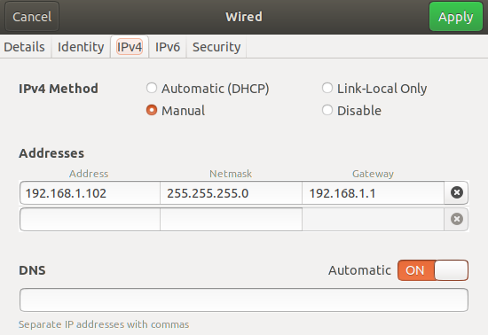

### 简介
**本项目是由YunLe提供的用于上位机控制云乐线控底盘的驱动程序, **用户可使用该驱动程序配合CAN连接设备在ROS环境下完成对底盘的控制.

目前支持的CAN连接设备是广成科技的以太网转CAN总线网关**GCCAN-212**, 传输模式使用的是UDP传输, GCCAN-212设备的设置请参考"以太网转CAN配置.pdf".

本项目已经在 Ubuntu18.04+ROS_Melodic 和 Ubuntu20.04+ROS_Noetic 环境下测试完成, 其他环境下的移植和测试需要用户自行处理. 

YunLe线控底盘提供底盘的CAN控制协议和数据反馈协议, 如果用户对本驱动程序有异议, 用户可自行编写CAN驱动以控制线控底盘. 

YunLe对该项目有最终所有权, 未经YunLe许可请勿将该项目开源.

### 简易运行步骤:
---

1. 创建ROS工作空间, 工作空间内创建src文件夹

2. 将本文件夹内的所有文件复制到src文件夹

3. 在ROS工作空间中打开终端并输入`catkin_make`编译项目

4. 输入: `source devel/setup.bash`

5. 运行`roslaunch can_bridge can_bridge_nwd.launch`

**注意**:运行第5步需要对CAN盒和launch文件进行配置, CAN盒配置请参考"以太网转CAN配置.pdf"

### launch文件配置
---

.launch文件位于./can_bridge/launch/can_bridge_*.launch, 其中星号代表不同的车型名称, 目前支持的车型有**NWD**系列和**JD**系列, 根据所要控制的车型以及上位机的IP进行文件的配置. 配置文件的具体解释如下:

<launch>

    <node pkg="can_bridge" name="can_bridge" type="can_bridge_node" output="screen">
        <!--  0:usb2can; 1:eth_can_udp -->
        <param name="can_type" type="int" value="1"/> 
    
        <!-- USB2CAN -->
        <param name="main_can_id" type="int" value="2" />         <!--1:CAN1 2:CAN2  -->
        <param name="debug_can_id" type="int" value="1" />
    
        <!-- EthCan_UDP -->
        <param name="can_eth_card" type="string" value="enp0s31f6" />
        <param name="can1_remote_ip" type="string" value="192.168.1.10" />
        <param name="can1_remote_port" type="int" value="4001" />
        <param name="can2_remote_ip" type="string" value="192.168.1.10" />
        <param name="can2_remote_port" type="int" value="4002" />
        <param name="local_ip" type="string" value="192.168.1.102" />
        <param name="local_port" type="int" value="8001" />
    
        <!-- Common -->
        <param name="debug_mode" type="bool" value="false" />
        <param name="show_sending_msg" type="bool" value="false" />
        <param name="car_type" type="string" value="NWD" />
        <param name="vehicle_weight" type="double" value="30" />
    </node>

</launch>

|       名称       |                可选值                 |            释义            |
| :--------------: | :-----------------------------------: | :------------------------: |
|     can_type     |                0 或 1                 |  默认为1,以太网的udp模式   |
|   main_can_id    |                1 或 2                 | 默认为2, 控制底盘的can的id |
|   can_eth_card   |         根据本机网口名称设置          |          网口名称          |
|  can1_remote_ip  | 默认为192.168.1.10, 可在CAN上位机设置 |        CAN1的远程IP        |
| can1_remote_port |     默认为4001, 可在CAN上位机设置     |     CAN1的远程IP端口号     |
|  can2_remote_ip  | 默认为192.168.1.10, 可在CAN上位机设置 |        CAN2的远程IP        |
| can2_remote_port |     默认为4002, 可在CAN上位机设置     |     CAN2的远程IP端口号     |
|     local_ip     |       根据本机网口的IP进行设置        |   **本机连接CAN盒的IP**    |
|    local_port    |       根据本机网口的端口号设置        |        本机IP端口号        |
|    debug_mode    |             true 或 false             |      是否为debug模式       |
| show_sending_msg |             true 或 false             |      是否需要输出指令      |
|     car_type     |            NWD, JD01, JD03            |        线控底盘型号        |
|  vehicle_weight  |                   /                   |             /              |

**注意事项**

1. can_eth_card可以通过在终端输入 `ip a` 或 `ifconfig` 查看, 网卡序号后面的名称即是网口名称, 如果用户有多个网口, 需要注意连接该网口名称为连接CAN盒的网口. 

2. local_ip本机IP需要与CAN盒IP处于同一网段, 一般默认使用192.168.1.* 网段, 可通过手动设置网口IP, 如设置上位机IP为192.168.1.102可如下图所示.

   

3. car_type需要根据线控底盘的型号设置, 具体型号可咨询YunLe售后.

### Subscriber/Publisher Topic
---

**Subscriber:**  

| type          | topic  |
| :------------ | :----- |
| can_msgs::ecu | "/ecu" |

**Publisher:**  

| type                     | topic             |
| :----------------------- | :---------------- |
| can_msgs::vehicle_status | "/vehicle_status" |
| can_msgs::battery        | "/battery"        |

### 数据格式

---

具体的消息数据格式可参考 **./can_msgs/msg** 文件夹下的消息定义

1.**ecu**数据格式:

|    名称     | 数据类型 |                    释义                     |
| :---------: | :------: | :-----------------------------------------: |
|    motor    | float32  |  目标速度, 下发消息时需要设置, 单位: km/h   |
|    steer    | float32  |  目标转向, 下发消息时需要设置, 单位为角度   |
|    brake    |   bool   |            紧急停车, true为使能             |
|  cur_speed  | float32  |            当前速度值, 无需设置             |
| speed_ratio | float32  |                控制速度比率                 |
|    shift    |  uint8   | 档位设置, 可设置为1--前进, 2--停止, 3--后退 |

2.**vehicle_status**数据格式

|      名称       | 数据类型 |                      释义                      |
| :-------------: | :------: | :--------------------------------------------: |
|    cur_speed    | float32  |              当前车速, 单位: m/s               |
|    cur_steer    | float32  |           当前转向角度, 单位: 度(°)            |
| wheel_direction |  uint8   |                  车轮转向方向                  |
|   shift_level   |  uint8   |       当前档位 1--前进, 2--停止, 3--后退       |
|   drive_mode    |  uint8   | 驾驶模式, 1--遥控, 2--pad模式, 3--自动驾驶模式 |

3.**battery**数据格式

|     名称      | 数据类型 |            释义            |
| :-----------: | :------: | :------------------------: |
|    voltage    | float32  |   动力电池 电压 单位：V    |
|    ampere     | float32  |   动力电池 电流 单位：A    |
|   capacity    | float32  | 动力电池 电量 单位：百分比 |
| BmuSys_status |  uint8   |      电源管理系统状态      |
| Charge_status |  uint8   |        电池充电状态        |

